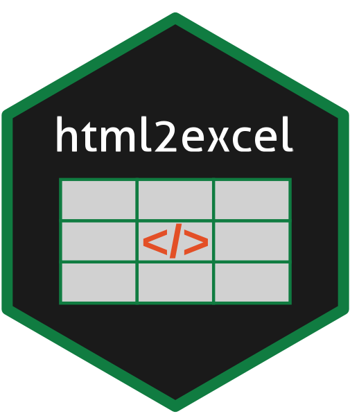

<!-- README.md is generated from README.Rmd. Please edit that file -->

```{r, include = FALSE}
knitr::opts_chunk$set(
  collapse = TRUE,
  comment = "#>",
  out.width = "100%"
)
library(htmltools)
knitr::knit_hooks$set(imgcenter = function(before, options, envir){
  if (before) {
    HTML("<p align='center'>")
  } else {
    HTML("</p>")
  }
})
```

# html2excel <a href="https://paulnorthrop.github.io/html2excel/"></a>

[](https://github.com/paulnorthrop/html2excel/actions/workflows/R-CMD-check.yaml)
[](https://app.codecov.io/github/paulnorthrop/html2excel?branch=master)
[](https://cran.r-project.org/package=html2excel)
[](https://cran.r-project.org/package=html2excel)
[](https://cran.r-project.org/package=html2excel)

## Convert HTML Tables to an Excel File


Reads tables from 'HTML' documents. The tables are returned as a list of tibbles and may be written to 'Excel' files.
    
## An example

```{r}
library(html2excel)
```

## Installation

To install the current released version from CRAN:

```{r cran_installation, eval = FALSE, echo = TRUE}
install.packages("html2excel")
```

